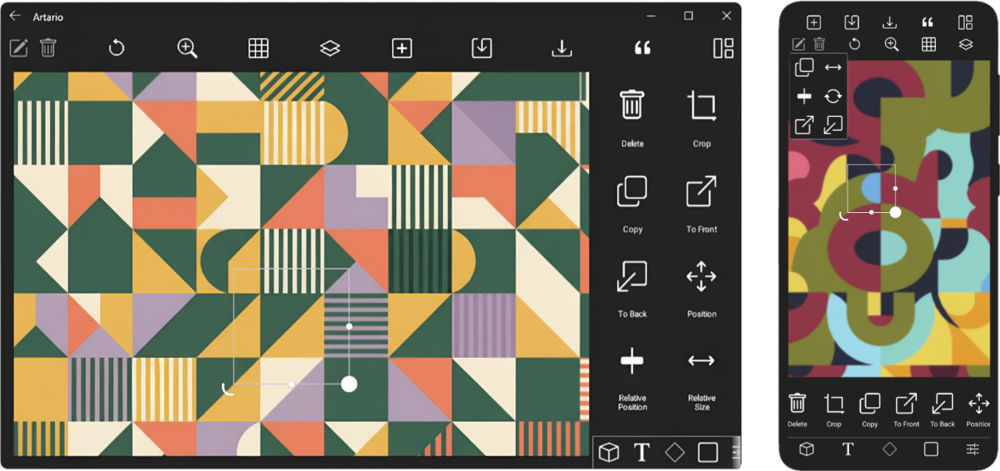

  

  

  Create Without Limits

## About the App
Artario is the ultimate graphic design tool for professionals and beginners alike. Create beautiful visuals, edit photos, and design amazing graphics with our intuitive interface.

### Screenshot
Experience our clean, intuitive interface designed for maximum productivity on phone & desktop.

  

> [!TIP]
> Organize your projects into `folders` or categories to find your work faster and keep everything neat.

## Contributing

If you'd like to contribute to Sketchware Pro, follow these steps:

1. Fork this repository.
2. Make changes in your forked repository.
3. Test out those changes.
4. Create a pull request in this repository.
5. Your pull request will be reviewed by the repository members and merged if accepted.

We welcome contributions of any size, whether they are major features or bug fixes, but please note that all contributions will be thoroughly reviewed.

### Commit Message

When you make changes to one or more files, you need to commit those changes with a commit message. Here are some guidelines:

- Keep the commit message short and detailed.
- Use one of these commit types as a prefix:
  - `feat:` for a feature, possibly improving something already existing.
  - `fix:` for a fix, such as a bug fix.
  - `style:` for features and updates related to styling.
  - `refactor:` for refactoring a specific section of the codebase.
  - `test:` for everything related to testing.
  - `docs:` for everything related to documentation.
  - `chore:` for code maintenance (you can also use emojis to represent commit types).

Examples:
- `feat: Speed up compiling with new technique`
- `fix: Fix crash during launch on certain phones`
- `refactor: Reformat code in File.java`

> [!IMPORTANT]
> If you’re using `Artario` on a phone or Android emulator, you can use the normal version. However, the WSA `(Windows Subsystem for Android)` version is recommended for WSA users, as it leverages the `/Windows/Artario/` directory integration to provide benefits such as fast access to exported images, projects, and text styles.
## Thanks for Contributing

Thank you for contributing to Sketchware Pro! Your contributions help keep Sketchware Pro alive. Each accepted contribution will be noted down in the "About Team" activity. We'll use your GitHub name and profile picture initially, but they can be changed, of course.

## Discord

Want to chat with us, discuss changes, or just hang out? We have a Discord server just for that.

## Disclaimer

This mod was not created for any harmful purposes, such as harming Sketchware; quite the opposite, actually. It was made to keep Sketchware alive by the community for the community. Please use it at your own discretion and consider becoming a Patreon backer to support the developers. Unfortunately, other ways to support them are not working anymore, so Patreon is the only available option currently. You can find their Patreon page [here](https://www.patreon.com/sketchware).

We do NOT permit publishing Sketchware Pro as it is, or with modifications, on Play Store or on any other app store. Keep in mind that this project is still a mod. Unauthorized modding of apps is considered illegal and we discourage such behavior.

We love Sketchware very much and are grateful to Sketchware's developers for creating such an amazing app. However, we haven't received updates for a long time. That's why we decided to keep Sketchware alive by creating this mod, and it's completely free. We don't demand any money :)
